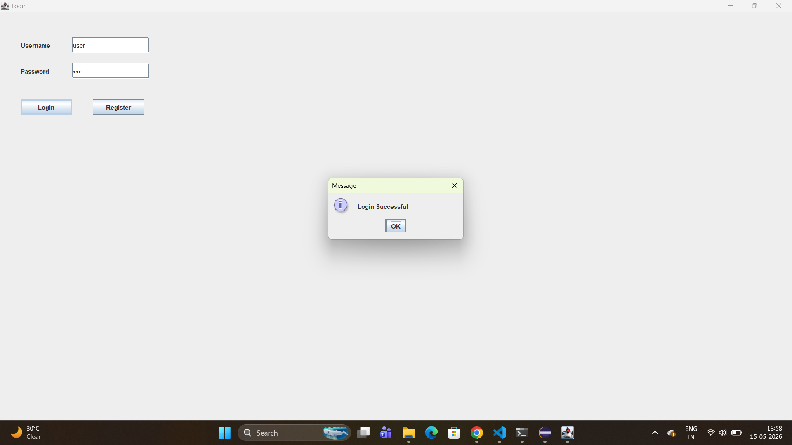
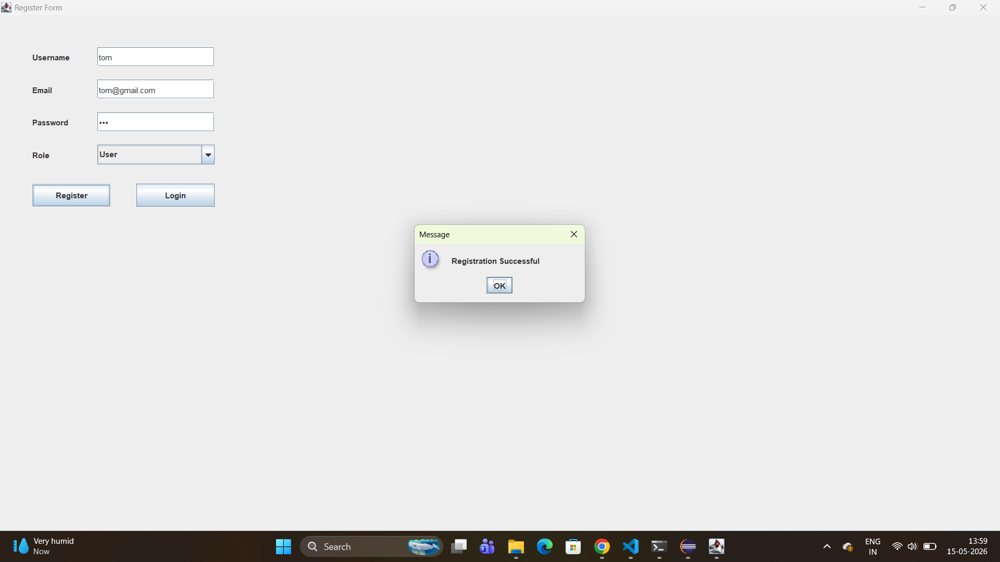
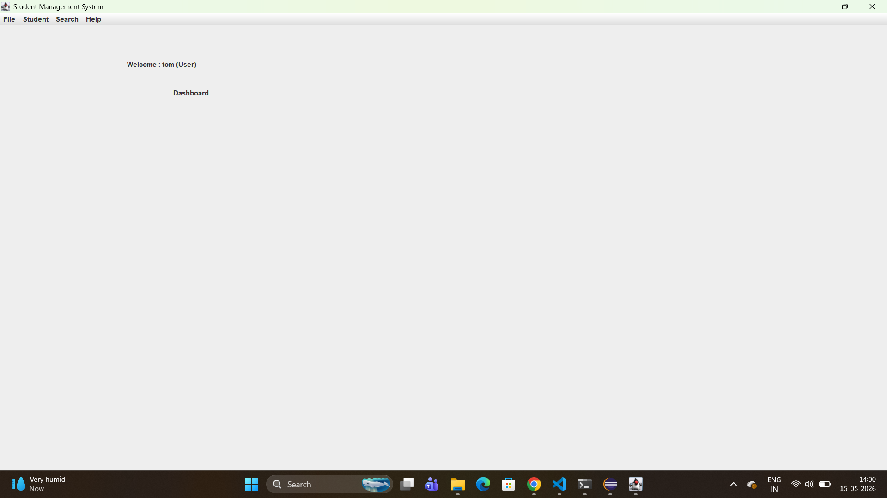
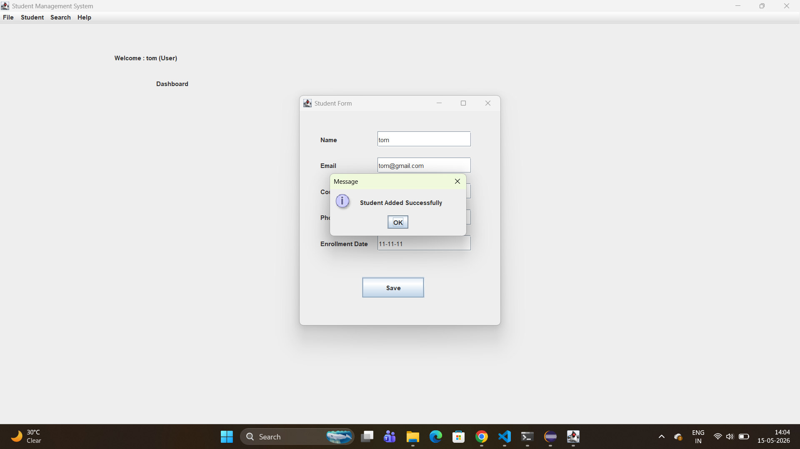
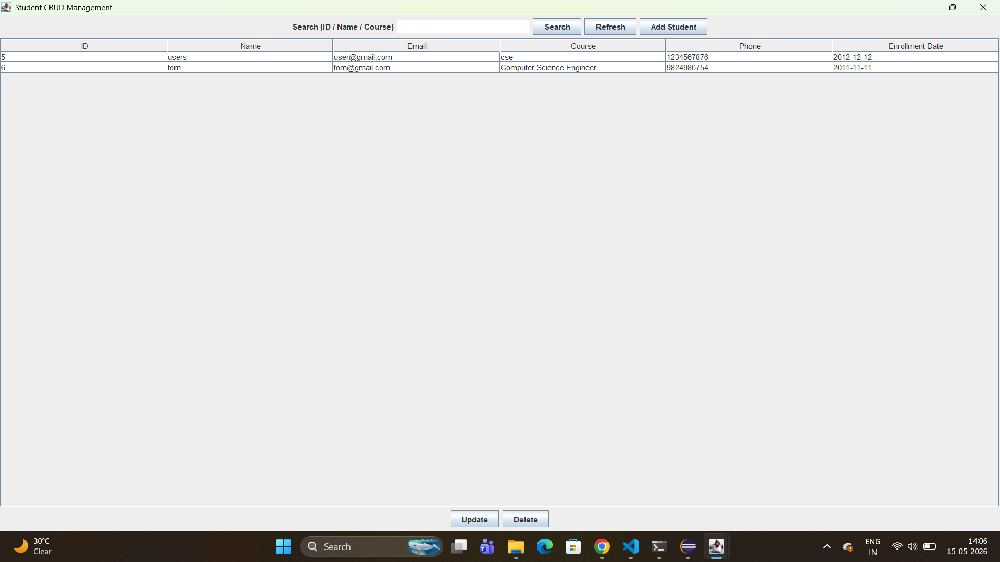
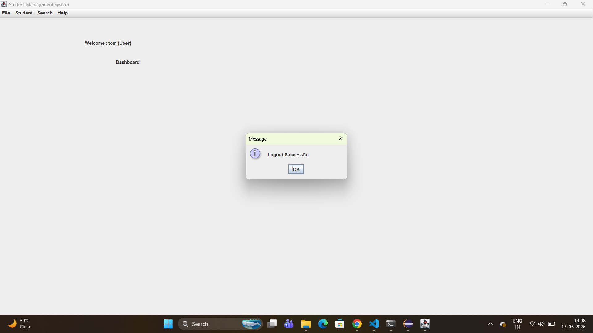

# Student Management System (Java Swing + JDBC + MySQL)

A simple desktop **Student Management System** made using **Java Swing** for UI and **JDBC** for database operations.

---

## Features

- **Login**
- **Register** (Admin/User role)
- **Dashboard** (Logout, Add Student, Search Student, About)
- **Student CRUD**
  - Add Student
  - Update Student
  - Delete Student
  - Search Students
  - View all students

---

## Screenshots

### Login

### Register

### Dashboard

### Student Form (Add/Update)

### Search Panel (CRUD)

### Logout

---

## Tech Stack

- Java
- Java Swing (UI)
- JDBC (Database connection)
- MySQL

---

## Project Structure (Quick)

- `src/Main.java` → Starts the app (opens `LoginForm`)
- `src/ui/*` → Swing screens (Login, Register, Dashboard, StudentForm, SearchPanel)
- `src/db/DBConnection.java` → MySQL connection
- `src/dao/*` → Database queries (UserDAO, StudentDAO)
- `src/model/*` → Data models (User, Student)

---

## How to Run

### Option 1: Using Eclipse (recommended)
1. Open this project in Eclipse.
2. Make sure MySQL JDBC driver is added to your build path.
3. Run `src/Main.java`.

### Entry Point
- Run `Main.java` (it opens the **Login** screen).

---

## Database Setup (MySQL)

### 1) Create Database
Create database:

- `StudentManagementSystem`

### 2) Connection Settings
The app connects using the settings in:

- `src/db/DBConnection.java`

Current values:
- URL: `jdbc:mysql://localhost:3306/StudentManagementSystem?useSSL=false`
- Username: `root`
- Password: `Sujeet@123`

> If your MySQL username/password is different, update them in `DBConnection.java`.

### 3) Expected Tables
The code uses these table names/columns:

- **users**
  - `user_id`
  - `username`
  - `email`
  - `password`
  - `role`

- **students**
  - `student_id`
  - `name`
  - `email`
  - `course`
  - `phone`
  - `enrollment_date`

---

## Usage Guide

### Login
- Enter **username** and **password**
- If credentials are correct → opens **Dashboard**

### Register
- Enter:
  - Username
  - Email
  - Password
  - Role (**Admin** or **User**)

### Student Management
From **Dashboard → Search Student**:
- **Add Student** → opens `StudentForm`
- **Search** → type keyword (ID / Name / Course)
- **Update** → select a row → click Update
- **Delete** → select a row → click Delete
- **Refresh** → reload all students

---

## Notes

- The app uses Swing dialogs (`JOptionPane`) to show success/error messages.
- Make sure MySQL server is running.

---

## Version

- Version 1.0

## 👨‍💻 Author

Sujeet Rajbhar

